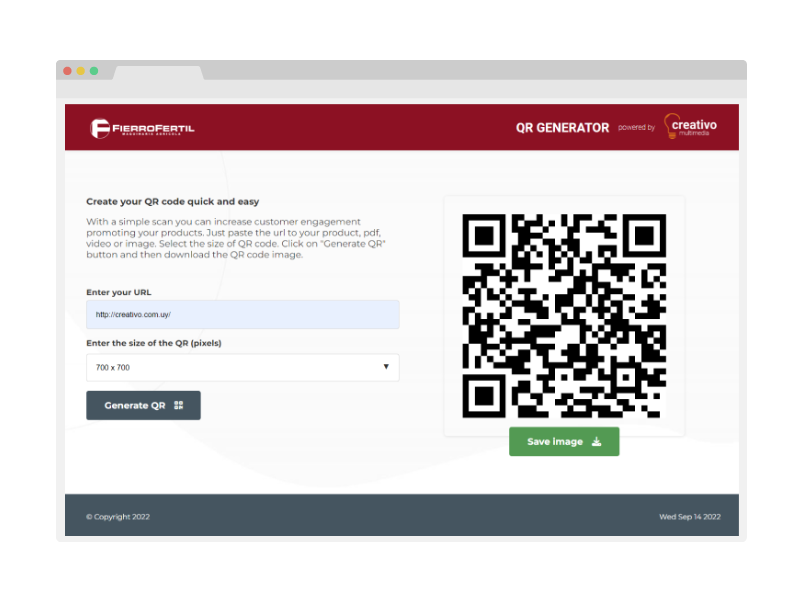

<div id="top"></div>

<!-- PROJECT LOGO -->
<br />
<div align="center">

<h3 align="center">QR generator</h3>
    Developed by <a href='https://creativo.com.uy/' target='_blank'>Creativo Multimedia</a>
  <p align="center">
    <a href="https://creativo.com.uy/qr/" target="_blank">View Demo</a>
  </p>
</div>


<!-- ABOUT THE PROJECT -->
## About The Project



Generate free QR codes on from any URL.
Just paste the url to a web, product, pdf, video or image. Select the size of QR code. Click on "Generate QR" button and then download the QR code image.

<p align="right">(<a href="#top">back to top</a>)</p>


### Built With


<p align="right">(<a href="#top">back to top</a>)</p>


### Installation

1. Clone the repo
  ```sh
  git clone https://github.com/lopezrunco/qr-generator-vanilla-js.git
  ```
2. Compile SASS into CSS
  ```sh
  sass --watch styles/main.scss css/main.css
  ```

<p align="right">(<a href="#top">back to top</a>)</p>
